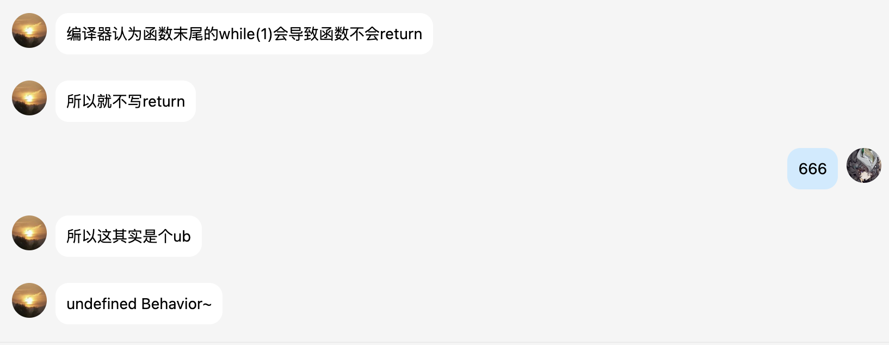

# SCPU-Pipeline
基本流水线架构的CPU.


## Hint
### Icarus Verilog
如果你使用*Icarus Verilog*,那么你需要解决`Counter`模块对中断带来的BUG.在一个always块里写:
```verilog
force uut.U9_Counter_x.counter0_OUT = 1'b0;  // 强制counter不触发
```
或者,如果你的计时器中断正确写好了,你也得写这个:
```verilog
force uut.U9_Counter_x.counter_ch = 2'b0;
//这个channel被SPIO驱动了,我们没有办法在仿真里验证.
//同时,代码里不能有对counter赋值的语句.
```

### fuck interrupt
并且,.所以,在`coe`的末尾,加上
```asm
ff9ff06f
ff5ff06f
```
来防止出现潜在的BUG.

在实际中,我用了`ROM.v`替代coe,并在PC的最后生成了几条`FFDFF06F(jal x0,-4)`.

并且,遇到了“稳定触发7次中断就会死掉”的bug.这是由于`mret`之后没有正确flush流水线,导致错误的执行了`mret`的下一条指令,也就是开栈针.需要考虑
# TIMELINE-BACKUP
- 3.27 验收了单周期CPU
- 发现在连续的JAL指令会出现bug,原因出自跳转确认被放置在了EX/MEM阶段.解决办法是在ID/EX特判一下JAL(没错,我单周期判断JAL是通过branch & RegDest的信号判断的而不是单独传一个JAL信号)
- 发现在第六关会出现JALR跳转错误的bug,导致第六关被运行了多次.原因是没有处理lw和jalr存在的冒险,忘记写旁路了.解决办法是
```verilog
assign jump_target = (ID_EX_rd1 + ID_EX_imm) & ~32'b1;//old
assign jump_target = (forward_A_val + ID_EX_imm) & ~32'b1;//new
```
- 3.28 成功实现流水线并PUSH.
- 3.30 实现了在Mac上跑*Icarus Verilog*仿真,不需要vivado那么冗长的仿真步骤了.具体操作:替换`blk_mem_gen_4`和`dist_mem_gen_2`为.v文件,并运行`iverilog -o sim.out *.v && vvp sim.out`.
- 3.30 增加了2bit(不带BTB的)动态预测.预测正确率:hit=46664 miss=11550 rate=80%
- 3.31 增加了中断(maybe???)
- 4.4 实现了`RISCV-GNU-TOOLS`工具链的安装,开始自己写代码汇编
- 4.7 实现了VGA模块和PS2模块(也许).
- 4.13 i hate rebuttal.
- 4.15 实现了声音,UNISON.
- 4.22 成功测试键盘中断,现在他可以在显示器上实现初步的MIDI可视化功能了.
# Acknowledge
- thx [Zoomy](https://github.com/zoomy14112/SingleCPU)