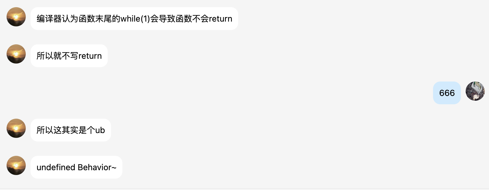

# MIDI-Controller
RISCV流水线架构的CPU,支持键盘中断/VGA显示/声音输出.
> How'd you make future riddim with no hope for the future?

Author: [ysz](https://github.com/whoiskiwiizzz),[zmy](https://github.com/zoomy14112) w/equal contribution

Project Homepage : [here](https://whoiskiwiizzz.github.io/Projects/02-SCPU/)

Video Preview: [here](https://www.bilibili.com/video/BV1r6Lw6mESC)


## Project Overview
```
SCPU/
├── MIDIcontroller/            # 主工程源码 (Vivado工程目录)
│   ├── SCPU.v                 # CPU 顶层 (取指/译码/执行/访存/写回)
│   ├── SCPU_top.v             # 系统顶层 (CPU + 外设互联)
│   ├── alu.v                  # ALU 算术逻辑单元
│   ├── ALUcontrol.v           # ALU 控制信号生成
│   ├── control.v              # 主控制单元 (指令译码→控制信号)
│   ├── immgen.v               # 立即数生成器 (RISC-V I/S/B/U/J格式)
│   ├── jump.v                 # 跳转/分支判断单元
│   ├── mux.v                  # 多路选择器集合
│   ├── predict.v              # 2bit 动态分支预测器
│   ├── RF.v                   # 寄存器堆 (32×32bit)
│   ├── ROM.v                  # 仿真用
│   ├── RAM.v                  # 仿真用
│   ├── dm_controller.v        # 数据存储器控制器
│   │
│   ├── Counter_3_IO.v         # 定时器/计数器 (中断源)
│   ├── Enter.v                # 回车键检测
│   ├── MIO_BUS.v              # 内存映射 I/O 总线
│   ├── Multi_8CH32.v          # 8通道多路复用
│   ├── PS2IO.v                # PS/2 接口逻辑
│   ├── PS2KB.v                # PS/2 键盘解码
│   ├── SPIO.v                 # 串行外设接口
│   ├── SSeg7.v                # 七段数码管驱动
│   │
│   ├── vga_scan.v             # VGA 扫描时序生成
│   ├── vga_top.v              # VGA 顶层 (字符/图形叠加)
│   ├── chord_display.v        # 自动和弦识别(i.e.,MIR)
│   ├── gre_array.v            # 图形阵列缓存
│   │
│   ├── audio.v                # 音频合成顶层
│   ├── audio_interface.v      # 音频接口 (CPU ↔ 音频模块)
│   ├── adsr.v                 # ADSR 包络生成器
│   ├── sine.v                 # 正弦波振荡器
│   ├── piano_env.v            # 钢琴音色包络
│   ├── piano_table.v          # 钢琴波形表 (Wavetable)
│   ├── lpf.v                  # 低通滤波器
│   ├── clk_div.v              # 时钟分频
│   │
│   ├── sd_controller.v        # SD卡控制器 (未使用)
│   ├── SCPU_top_tb.v          # 仿真测试平台
│   ├── Multi_8CH32.edf        # 网表文件
│   ├── SPIO.edf               # 网表文件
│   └── SSeg7.edf              # 网表文件
│
├── coe/                       # IP核 COE 初始化文件
│   ├── font_ascii_8_8.coe     # VGA 字符 ROM 数据 
│   ├── MIDI.coe               # 主ROM
│   └── piano_table.coe        # 钢琴波形表数据
│
├── utils/                     # 工具脚本
│   ├── MIDI.c                 # RISC-V 汇编级 C 程序 (主固件)
│   ├── MIDI.s                 # 反汇编文件
│   ├── MIDI.bit               # 生成好的bit流.注意,这个bit流下板子时不能按空格!
│   ├── MIDI_2.bit        # 生成好的备份bit流.不确定VGA显示是否正常,但应该正常.
│   ├── coe_convert.py         # COE - DAT 格式转换
│   ├── convert.py             # COE → ROM.v 转换,用于仿真
│   ├── icf-v-p.xdc            # Vivado 约束文件 (引脚/时序)
│   ├── midi2song.py           # MIDI 文件 → 歌曲数据
│   ├── BS.mid            #演示MIDI.原曲:名为『我』之物-Bestune,kiwiizzz(2024)
│   └── 西湖边的100个拥抱.mid    # 演示MIDI.原曲:西湖边的100个拥抱-Bestune(2025)
│
└── simulation.sh              # Icarus Verilog 仿真脚本
```
## How to use
你需要一个Vivado.创建一个A7的板子工程.加入所有的`.v`和约束文件.把`SCPU_top.v`设置成顶层文件(而不是`SCPU_top_tb.v`).
### IP config
#### `ROM`
Distributed Memory Generator,Depth 8192,Data Width 32, 导入COE: `MIDI.coe`.
#### `RAM`
Bolck Memory Generator,Singal Port RAM, Byte Write Enable,8bit, Width 32,Depth 2048.

Enable Port Type **Always Enabled**.

COE随便选一个导入即可,这不重要;必要的东西都在高级语言初始化了.
#### `font_rom`
旨在提供VGA的字符支持.
和ROM一模一样,导入COE: `font_ascii_8_8.coe`.

#### `piano_rom`
旨在用IP核提供钢琴wavetable来避免时序问题.
Block Memory Generator,**Dual Port ROM**,Port A width 16,Depth 2048;Enable Port Type **Always Enabled**.

COE:`piano_rom.coe`.

## Hint
### 1. 有关高级语言
可以使用RISCV编译,高级语言位于`./utils/MIDI.c`中.注意由于某些中断问题,生成的`coe`的末尾必须要加至少三个`ffdff06f`.
### 2.Icarus Verilog
如果你使用*Icarus Verilog*,那么你需要解决`Counter`模块对中断带来的BUG.在一个always块里写:
```verilog
force uut.U9_Counter_x.counter0_OUT = 1'b0;  // 强制counter不触发
```
或者,如果你的计时器中断正确写好了,你也得写这个:
```verilog
force uut.U9_Counter_x.counter_ch = 2'b0;
//这个channel被SPIO驱动了,我们没有办法在仿真里验证.
//同时,代码里不能有对counter赋值的语句.
```

### 3.??? interrupt
并且,.所以,在`coe`的末尾,加上
```asm
ff9ff06f
ff5ff06f
```
来防止出现潜在的BUG.

在实际中,可以考虑生成`ROM.v`替代coe(参考`./utils/convert.py`),并在PC的最后生成了几条`FFDFF06F(jal x0,-4)`.

并且,遇到了“稳定触发7次中断就会死掉”的bug.这是由于`mret`之后没有正确flush流水线,导致错误的执行了`mret`的下一条指令,也就是开栈针.需要考虑
# TIMELINE-BACKUP
- 3.27 验收了单周期CPU
- 发现在连续的JAL指令会出现bug,原因出自跳转确认被放置在了EX/MEM阶段.解决办法是在ID/EX特判一下JAL(没错,我单周期判断JAL是通过branch & RegDest的信号判断的而不是单独传一个JAL信号)
- 发现在第六关会出现JALR跳转错误的bug,导致第六关被运行了多次.原因是没有处理lw和jalr存在的冒险,忘记写旁路了.解决办法是
```verilog
assign jump_target = (ID_EX_rd1 + ID_EX_imm) & ~32'b1;//old
assign jump_target = (forward_A_val + ID_EX_imm) & ~32'b1;//new
```
- 3.28 成功实现流水线并PUSH.
- 3.30 实现了在Mac上跑*Icarus Verilog*仿真,不需要vivado那么冗长的仿真步骤了.具体操作:替换`blk_mem_gen_4`和`dist_mem_gen_2`为.v文件,并运行`iverilog -o sim.out *.v && vvp sim.out`.
- 3.30 增加了2bit(不带BTB的)动态预测.预测正确率:hit=46664 miss=11550 rate=80%
- 3.31 增加了中断(maybe???)
- 4.4 实现了`RISCV-GNU-TOOLS`工具链的安装,开始自己写代码汇编
- 4.7 实现了VGA模块和PS2模块(也许).
- 4.13 i hate rebuttal.
- 4.15 实现了声音,UNISON.
- 4.22 成功测试键盘中断,现在他可以在显示器上实现初步的MIDI可视化功能了.
- 5.22 验收.
# Acknowledge
- thx [Zoomy](https://github.com/zoomy14112/SingleCPU)
- thx [megakite](https://www.bilibili.com/video/BV1Vt411D7Ps), who guided me towards the Electronic Music production. VGA display is built inspired of his video.
- thx [Bestune](https://space.bilibili.com/100556278), who gave me a lot of MIDI to practice , and write the melody of the [song](https://music.163.com/#/song?id=2029041492) which i played in the video.

# License
MIT
